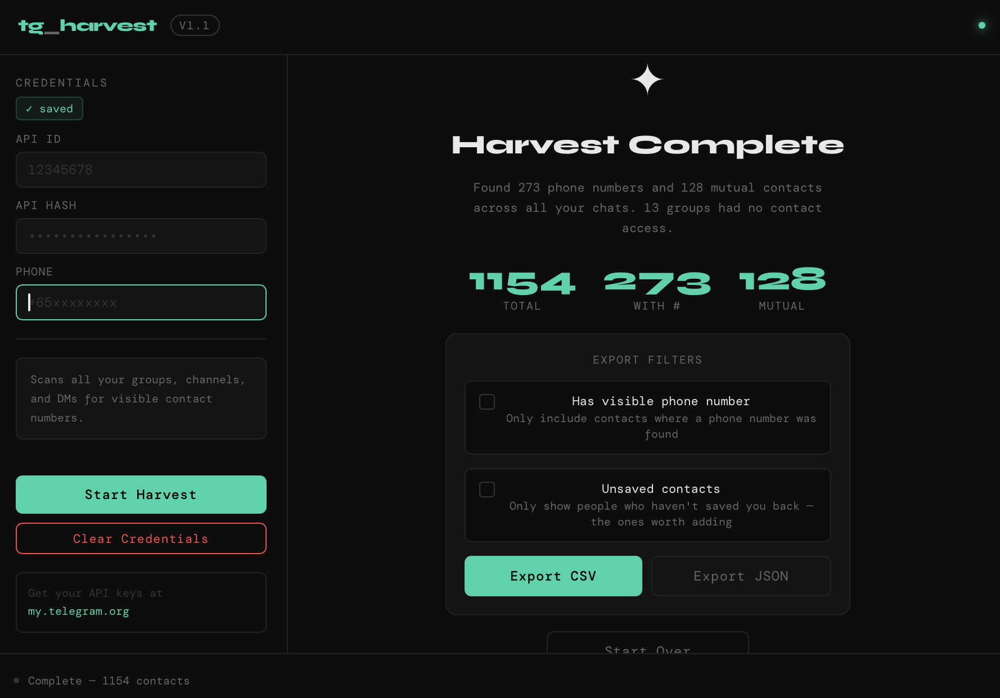

# tg_harvest

> Extract visible contact numbers from your Telegram groups, channels, and DMs in one clean desktop app.


---



## What it does

Telegram does not give you a simple way to review the contact numbers visible across your chats. `tg_harvest` connects through Telegram's official API, scans the groups, channels, and DMs available to your account, and exports the visible contact data into CSV or JSON.

The app is intentionally direct: enter your Telegram API credentials, run the scan, review the results, apply export filters if needed, and save the file to your Desktop.

## Features

- Scans groups, channels, and direct messages from a single desktop window
- Extracts visible phone numbers while respecting Telegram privacy settings
- Captures names, usernames, last seen status, Premium status, mutual-contact status, and source chat
- Excludes bots and avoids duplicate users or duplicate phone numbers
- Shows scan progress and a final summary, including chats where member access was restricted
- Exports CSV or JSON directly to the Desktop
- Supports export filters for phone-number-only and unsaved-contact-only lists
- Stores Telegram credentials locally with restricted file permissions
- Includes a clear-credentials action for resetting local config and session files

## Requirements

- macOS
- Python 3.9+
- A Telegram account
- Telegram API credentials from [my.telegram.org](https://my.telegram.org)

## Getting started

### 1. Create Telegram API credentials

1. Go to [my.telegram.org](https://my.telegram.org) and sign in.
2. Open **API Development Tools**.
3. Create a new app with any name and description.
4. Copy the generated **API ID** and **API Hash**.

### 2. Install dependencies

```bash
pip3 install telethon pywebview
```

### 3. Run the app

```bash
python3 main.py
```

On first launch, enter your API ID, API Hash, and phone number. If Telegram requires a login code or 2FA password, the app will prompt for it during the first connection.

## Export fields

| Field | Description |
|---|---|
| `first_name` | Contact's first name |
| `last_name` | Contact's last name |
| `username` | Telegram username, when available |
| `phone` | Visible phone number, when available |
| `last_seen` | Online, recently, last week, last month, offline date, or unknown |
| `is_mutual` | Whether the person is marked as a mutual contact |
| `is_premium` | Whether Telegram reports the user as Premium |
| `source_group` | The chat where the contact was first found |

## Export filters

The results screen always starts with the full raw scan. Before exporting, you can narrow the output:

- **Has visible phone number** keeps only rows with a visible phone number.
- **Unsaved contacts** keeps only rows that are not marked as mutual contacts.

Both filters can be combined for a tighter outreach or cleanup list.

## Privacy and security

- Processing happens locally on your Mac.
- The app communicates only with Telegram's official API through Telethon.
- Telegram credentials are saved to `~/.tg_harvest_config.json`; the Telegram session is saved beside `~/.tg_harvest_session`.
- Phone numbers appear only when Telegram makes them visible to your account.

To revoke access, click **Clear Credentials** in the app or terminate the session manually from **Telegram Settings > Devices**.

## Notes

- Some large or private channels restrict participant listing. These are counted in the scan summary rather than treated as fatal errors.
- Telegram privacy settings still apply. If a user's number is hidden from your account, `tg_harvest` cannot extract it.
- Exports are timestamped as `tg_contacts_YYYYMMDD_HHMM.csv` or `.json`.

## Built with

- [Telethon](https://github.com/LonamiWebs/Telethon) for Telegram MTProto access
- [pywebview](https://pywebview.flowrl.com/) for the native macOS desktop shell
- Vanilla HTML, CSS, and JavaScript for the interface

## License

MIT. Use it, adapt it, and keep it respectful.
